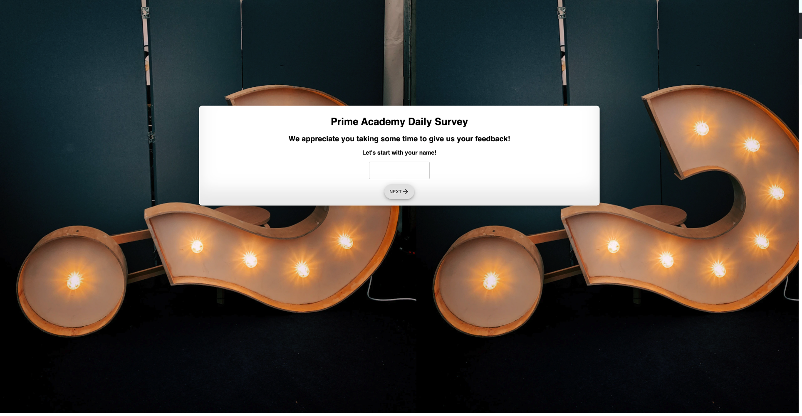
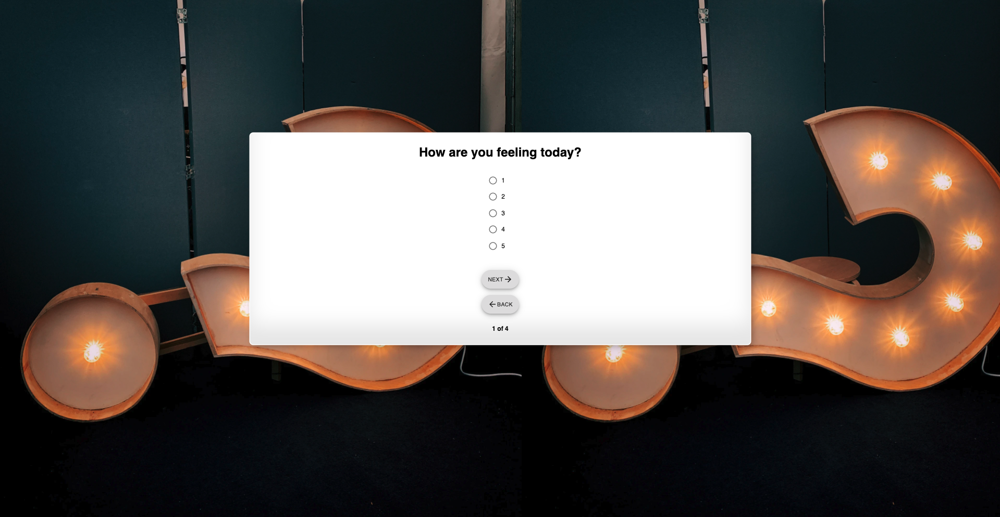
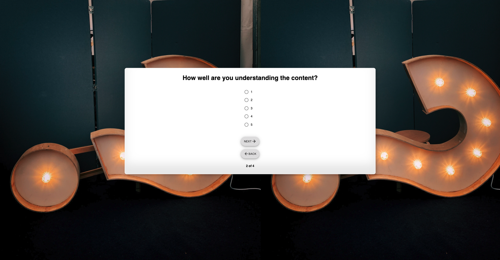
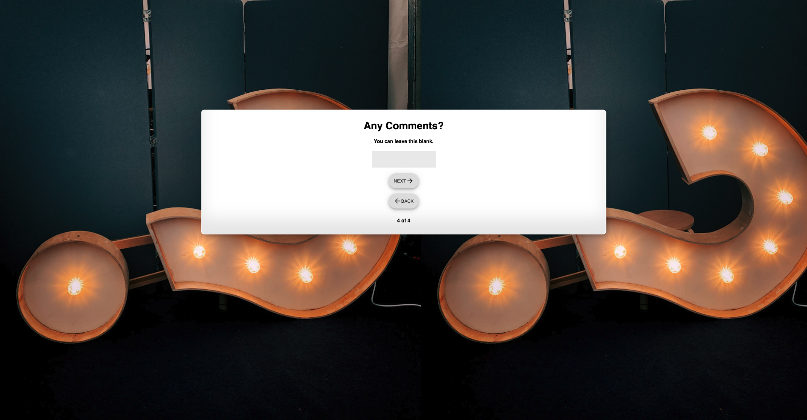
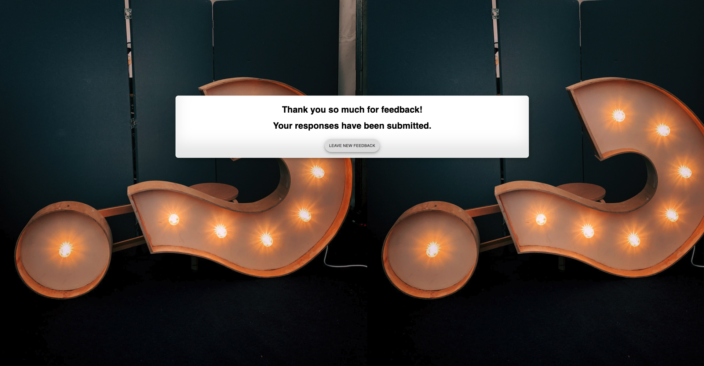
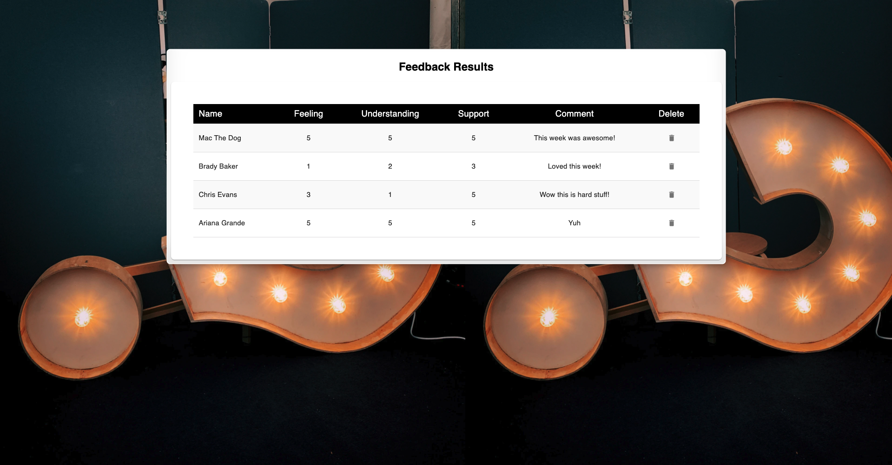

# The Feedback Collector

## Description

Duration: 15hrs

This web application is a full-stack feedback survey/collector for student and instructor use. The student are able to express how they are feeling overall, how well they are understanding the content, 
how supported they are feeling by the staff, and able to leave comments as well. Instructors can navigate to the admin page to see the collection of all the responses. The responses are ordered newest to oldest. 
Instructors are able to delete any responses at their discretion. 

## Screen Shot

## Prerequisites

- Node.js
- Axios
- pg
- Material-UI core/icon
- Redux 

## Installation 

1. Create a table called prime_feedback
2. Copy code from data.sql into your db
3. run `npm install`
4. In two different terminals run `npm run server` and `npm run client`
5. Web app is viewable on localhost:3000

## Usage

- If you are a student - Fill out the survey as instructed. You are able to go back and change your answers if you would like. 
- If you are an instructor - Navigate to the `/admin` page to review all of the results 

## Built With 

- React
- Redux
- SQL
- Axios
- Material-UI core/icons
- CSS 

## Acknowledgment 

Thanks to Prime Digital Academy who equipped and helped me to make this application a reality. Also, thanks to my cohort, Vatti, for assisting me with any problems that arose while I was working on my project (WAKA WAKA). 

## Support

Please reach out to me through email at bradybaker82@gmail.com with any questions or concerns about this project!